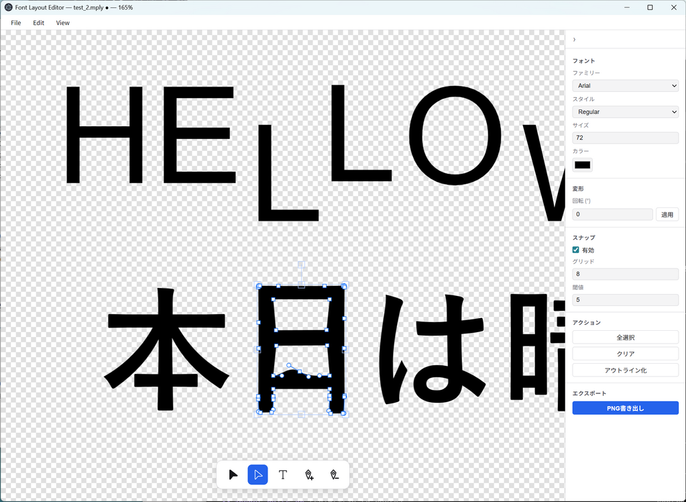

# mojiplay

A desktop app for laying out text character-by-character, converting it to bezier outlines, editing the paths, and exporting the result as a transparent PNG.



Each character you type becomes an independent, movable object on the canvas. From there you can outline it (Photoshop / Illustrator "create outlines" style), drag anchor points, and finally copy or export the result as a transparent PNG — useful for building logos and lettering pieces out of individual glyphs.

## Features

- Type text and have each character placed as a separate, independently movable object
- Drag, rotate, and scale characters freely with the mouse
- Apply font / size / color changes to the current selection in real time
- **Outline** (`Ctrl+Shift+O`) — convert text into bezier paths (Illustrator-style "create outlines")
- White-arrow tool to drag anchor points and edit path shapes
- Add / remove anchor points with the pen tool
- Copy the selected objects to the clipboard as a transparent PNG (`Ctrl+C` / Edit → Copy)
- Export to a transparent PNG file
- `Delete` / `Backspace` to remove selected objects
- `Alt` + mouse wheel to zoom (centered on the cursor)
- Grid snapping in white-arrow mode (hold `Alt` to bypass temporarily)
- Undo / redo with `Ctrl+Z` / `Ctrl+Shift+Z`
- Save / open native `.mply` documents (atomic write, dirty-state tracking, unsaved-changes guard on close)

## Installation

Requires Node.js v20 or later.

```bash
git clone git@github.com:ddk50/mojiplay.git
cd mojiplay
npm install
```

## Run

```bash
npm start
```

## Test

```bash
npm test
```

Unit tests run on [Jest](https://jestjs.io/) via [ts-jest](https://kulshekhar.github.io/ts-jest/).

## Build a Windows binary

[electron-builder](https://www.electron.build/) is used to produce a portable `.exe` (x64).

### 1. Install wine on WSL2 / Linux

`wine` is needed to rewrite the executable's metadata (Ubuntu / Debian example):

```bash
sudo apt update
sudo apt install -y wine64
```

### 2. Build

```bash
npm run dist:win
```

The artifact is written to:

```
release/mojiplay-1.0.0-portable-x64.exe
```

Copy it to any Windows PC and run — no installer needed.

### Smoke test only (no wine required)

```bash
npm run pack
```

Produces an unpacked runtime directory at `release/win-unpacked/`. Copying the inner `mojiplay.exe` to a real Windows machine is enough to launch it.

### Replacing the app icon

Drop a `build/icon.ico` (256×256 or larger) into the repo and it becomes the app icon automatically. See [`build/README.md`](./build/README.md) for details.

## Tech stack

| Purpose               | Library                                                                       |
| --------------------- | ----------------------------------------------------------------------------- |
| Desktop framework     | [Electron](https://www.electronjs.org/) v29                                   |
| Canvas / interaction  | [Fabric.js](http://fabricjs.com/) v5.3                                        |
| Glyph path extraction | [fontkit](https://github.com/foliojs/fontkit) v2                              |
| Tests                 | [Jest](https://jestjs.io/) + [ts-jest](https://kulshekhar.github.io/ts-jest/) |

## License

MIT
